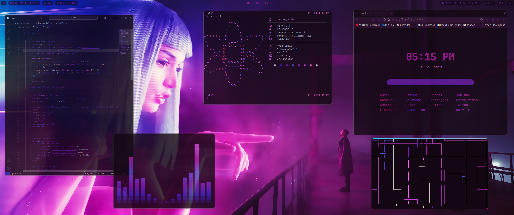
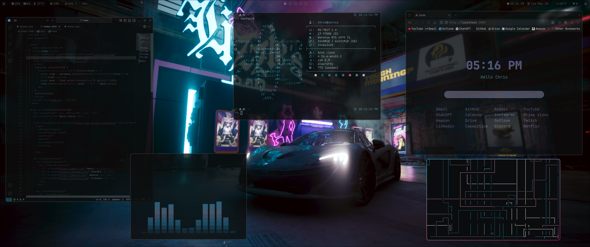
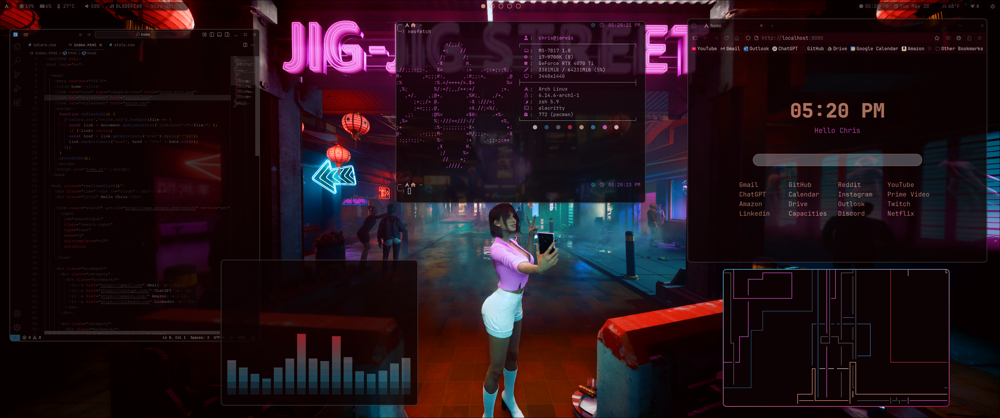
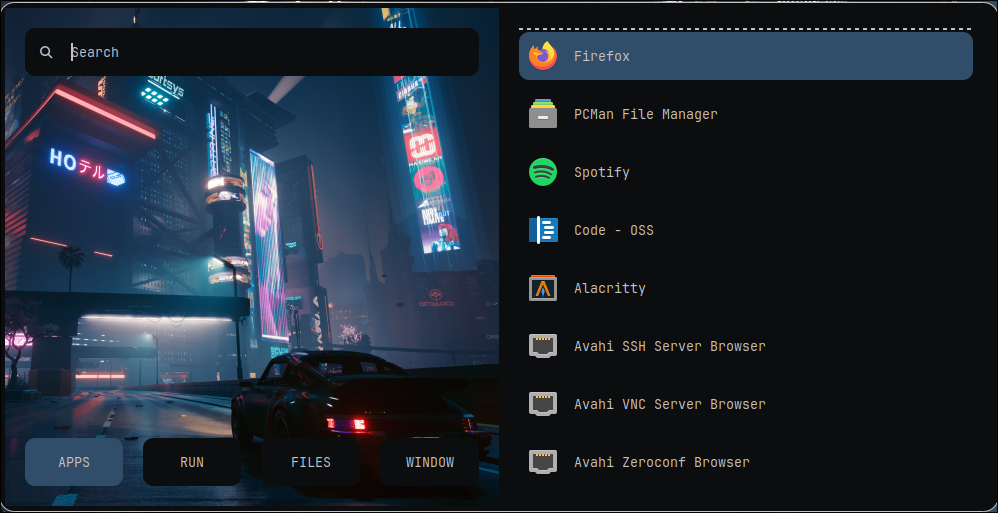
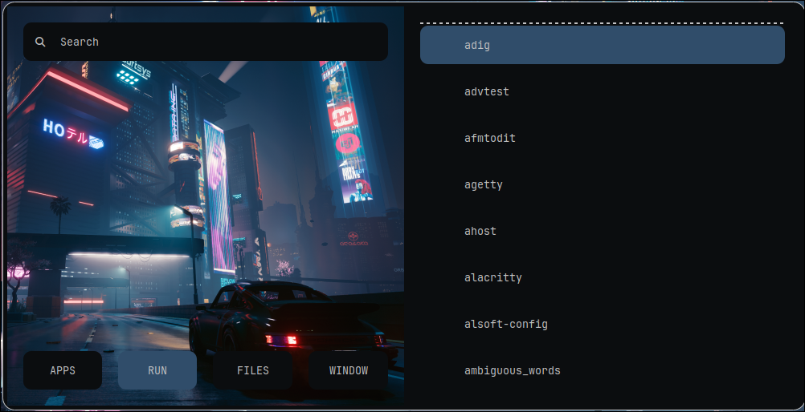
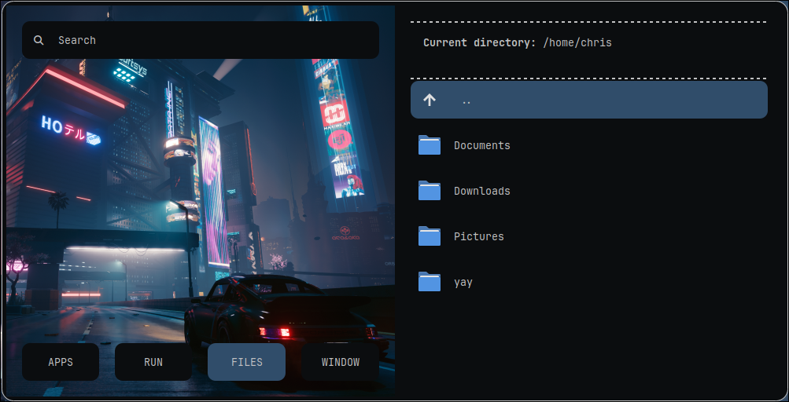
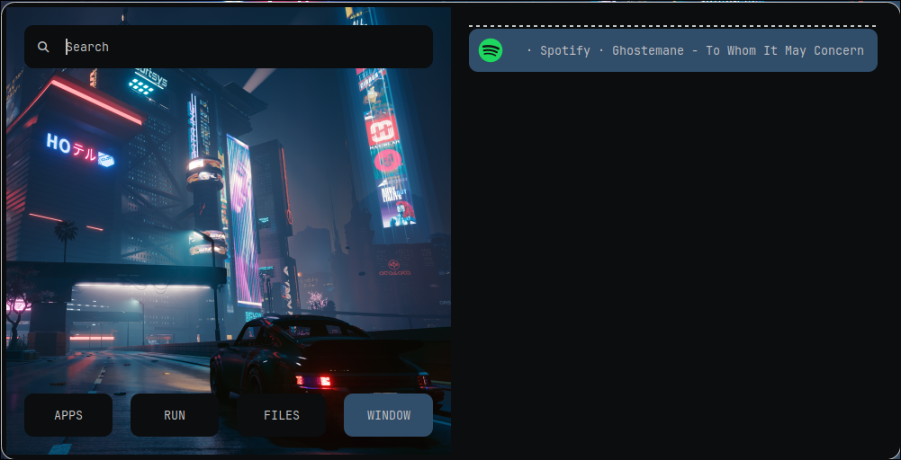

<h2 align="center"> ━━━━━━  ❖  ━━━━━━ </h2>

# Chris' dotfiles

<a name="about"/>

## 👋 <samp>About</samp>

<!-- <https://github.com/prasanthrangan/hyprdots/assets/106020512/7f8fadc8-e293-4482-a851-e9c6464f5265> -->

This is my personal repository for my Arch dotfiles.

Here is some information about my setup: 

- Window Manager: [`hyprwm`](https://github.com/hyprwm/Hyprland)
- Compositor: [`hyprland`](https://github.com/hyprwm/Hyprland)
- Terminal: [`alacritty`](https://github.com/alacritty/alacritty)
- Shell: [`zsh`](https://www.zsh.org/) ([`p10k`](https://github.com/romkatv/powerlevel10k/))
- Editor: [`neovim`](https://github.com/neovim/neovim)
- Panel: [`waybar`](https://github.com/Alexays/Waybar)
- Application Launcher: [`rofi`](https://github.com/davatorium/rofi)
- File Manager: [`pcmanfm`](https://github.com/lxde/pcmanfm)
- Browser: [`firefox`](https://www.mozilla.org/en-US/firefox/linux/)
- PC Lights: [`openrgb`](https://openrgb.org/)

<a name="showcase"/>

## :camera: <samp>Showcase</samp>

Here are five different colorschemes (using Pywal) based on the wallpapers in `~/assets/wallpapers`. The colorscheme automatically changes depending on the wallpaper:

COLORSCHEME 1


COLORSCHEME 2


COLORSCHEME 3


COLORSCHEME 4


COLORSCHEME 5


<h2></h2>

<a name="rofi-utils"/>

### <samp>Rofi</samp>

These rofi configurations are highly based on [adi1090x/rofi](https://github.com/adi1090x/rofi)

<h2></h2>

##### Rofi app launchers, directory menu and windows menu






<h2></h2>

##### Rofi power menu


<h2></h2>

<a name="fonts"/>

### <samp>Fonts</samp>

- [`JetBrainsMono Nerd Font`](https://github.com/jtbx/jetbrainsmono-nerdfont)

<a name="setup"/>

### <samp>Background Wallpaper</samp>

Copy the wallpapers into your `~/Pictures/Wallpapers` folder:

```sh
cp -r ~/Downloads/dotfiles-arch/wallpapers ~/Pictures/Wallpapers
```

`hyprpaper` is used to set the wallpaper in `hyprland.conf` using `wal-hypr.sh`. Different wallpapers can be used by changing the binds that call the main wal script.

<h2></h2>

<a name="firefox"/>

### <samp>Firefox</samp>

<h2></h2>

### <samp>Hyprwm Keybindings</samp>

|Action|Keybinding|
|---|---|
|App launcher|<code>super + d</code>|
|Terminal|<code>super + Return</code>|
|Restart bspwm|<code>super + r</code>|
|Close program|<code>super + q</code>|

<h2></h2>

<a name="credits"/>

## :tada: <samp>Credits</samp>

- `README.md` inspired by [HynDuf/dotfiles](https://github.com/HynDuf/dotfiles) and [HyDE-Project/HyDE](https://github.com/HyDE-Project/HyDE)
- [r/unixporn](https://www.reddit.com/r/unixporn/) making me want to rice my system everyday

<h2 align="center"> ━━━━━━  ❖  ━━━━━━ </h2>
