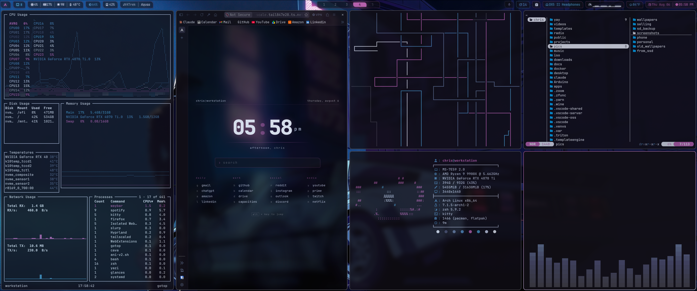
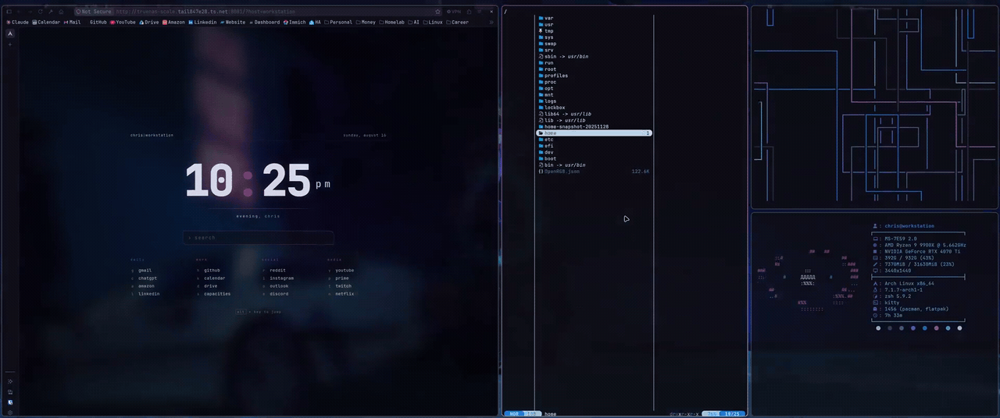
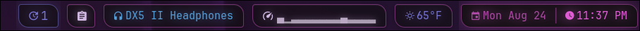
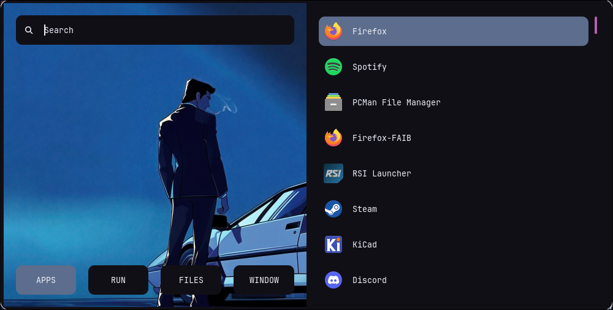
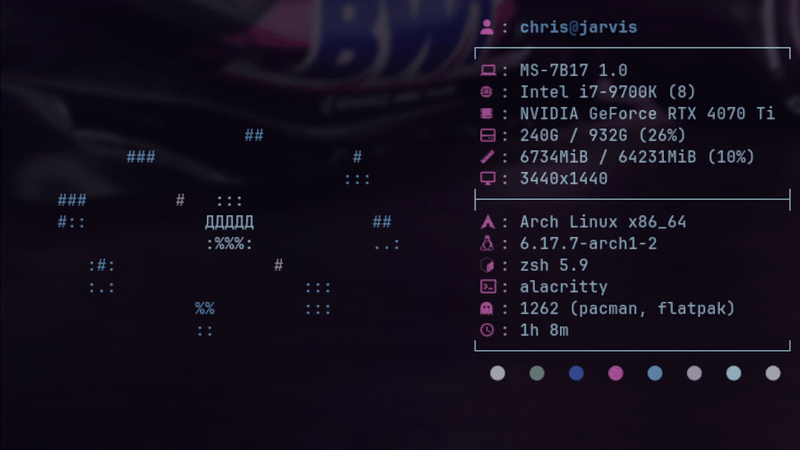

<h2 align="center"> ━━━━━━  ❖  ━━━━━━ </h2>

# Chris' dotfiles

<a name="about"/>

## <samp>About</samp>

Personal dotfiles for an Arch Linux desktop: Hyprland that re-themes itself from whatever wallpaper is on screen. Cyberpunk-leaning, built around a 3440x1440 ultrawide. This is what I actually run — a showcase, not an install-it-yourself tutorial.

| | |
|---|---|
| Window Manager | [`hyprland`](https://github.com/hyprwm/Hyprland) |
| Terminal | [`kitty`](https://github.com/kovidgoyal/kitty) |
| Shell | [`zsh`](https://www.zsh.org/) + [`powerlevel10k`](https://github.com/romkatv/powerlevel10k/) |
| Editor | [`neovim`](https://github.com/neovim/neovim) |
| Panel | [`waybar`](https://github.com/Alexays/Waybar) |
| Launcher | [`rofi`](https://github.com/davatorium/rofi) |
| File Manager | [`yazi`](https://github.com/sxyazi/yazi) (+ [`pcmanfm`](https://github.com/lxde/pcmanfm) for GUI drag-and-drop) |
| Notifications | [`mako`](https://github.com/emersion/mako) |
| Lock Screen | [`hyprlock`](https://github.com/hyprwm/hyprlock) |
| Wallpaper | [`hyprpaper`](https://github.com/hyprwm/hyprpaper) |
| Theme Engine | [`wallust`](https://codeberg.org/explosion-mental/wallust) |

<a name="showcase"/>

## <samp>Showcase</samp>

Every colour on the desktop is derived from the current wallpaper. Pick one with `Super + W` and the bar, terminal, launcher, lock screen, notifications, GTK/Qt apps, cava and yazi all follow in one pass.



<h2></h2>

### In motion

`Super + W`, pick a new wallpaper, and the whole desktop repaints in one pass.



<h2></h2>

### Waybar

Clipped-corner "plating" geometry, one typeface at one size, per-module accent colours pulled from the palette.



<h2></h2>

### Rofi

Based on [adi1090x/rofi](https://github.com/adi1090x/rofi). One theme drives the app launcher, clipboard history and wallpaper picker.



<h2></h2>

### Lock screen

`hyprlock`, themed from the same palette as the bar. Password only — see [Security notes](#security).


<h2></h2>

### Animated fetch

PewDiePie's animated ASCII frames, recoloured to the live palette, `fastfetch` supplying the system info. Run it with `neo`.



<h2></h2>

<a name="features"/>

## <samp>Key Features</samp>

- **Dynamic theming** — `wal-hypr.sh` runs wallust and propagates the palette to waybar, kitty, rofi, hyprlock, mako, cava, yazi, nvim, Firefox, GTK/Qt
- **Wallpaper picker** — `Super + W`, a rofi thumbnail grid over `~/pics/wallpapers`; drop a file in, it appears
- **Hardware-aware waybar** — GPU power draw or battery, whichever the machine has; network interface auto-detected too. Desktop and laptop run different module layouts from the same repo
- **Single-instance lock** — `Super + L` goes through a `flock` wrapper so a double-press can't spawn two lock clients
- **Split config** — `hypr/conf.d/` is numbered and topic-scoped rather than one long file
- **Machine-local overrides** — `hyprland-local.conf` and `secrets.env` keep per-machine and secret values out of the repo

<h2></h2>

<a name="keybindings"/>

## <samp>Keybindings</samp>

`Super` is the modifier throughout; destructive actions live under `Super + Shift`.

| Action | Bind |
|--------|------|
| Terminal / launcher / files | `Super + Return` / `D` / `E` |
| Close / float / fullscreen | `Super + Q` / `T` / `F` |
| Wallpaper picker | `Super + W` |
| Lock / power menu | `Super + L` / `X` |
| Clipboard / colour picker | `Super + V` / `C` |
| Move focus / window | `Super + arrows` / `Super + Shift + arrows` |
| Resize / preselect split | `Super + Ctrl + arrows` / `Super + Alt + arrows` |
| Switch / send to workspace | `Super + 1-0` / `Super + Shift + 1-0` |
| Layout presets | `Super + Alt + 1-4, E, R, C, G, 0` |
| Scratchpad | `Super + B` / `Super + Shift + B` |
| Window group (tabs) | `Super + G` / `Super + Shift + G` |
| Screenshot (region / output) | `Print` / `Super + Print` / `Super + Shift + Print` |

<h2></h2>

<a name="customization"/>

## <samp>Customization</samp>

Theming runs through `~/.local/bin/wal-hypr.sh <image>` — wallust, then every consumer in order. Templates live in `~/.config/wallust/templates/`; never hand-edit the rendered output in `~/.cache/wal/`.

Waybar is `config.jsonc` (layout) + `style-base.css` (styling) + `scripts/` (custom modules). `scripts/verify-glyphs.py` catches stripped or decayed icons after any edit.

A few things auto-detect at runtime instead of being hardcoded, so the same script runs correctly on both machines: GPU vs. battery in `hardware.sh`, network interface in `net-sparkline.py`, and panel vs. external-monitor brightness control in `~/.local/bin/brightness`.

<h2></h2>

<a name="security"/>

## <samp>Security notes</samp>

The lock screen is password-only, deliberately — `pam_usb` handles `sudo`/`su` but is intentionally excluded from hyprlock's PAM stack, since granting it there let the key unlock the screen before the password box even drew.

Always lock through `~/.local/bin/lock`, never bare `hyprlock`. It holds a `flock` mutex for hyprlock's lifetime so a double-press can't spawn two clients and strand the session unlocked. Escape hatch: `Super + Shift + L`.

<h2></h2>

<a name="structure"/>

## <samp>Repository Structure</samp>

```
dotfiles-arch/
├── .config/
│   ├── hypr/                    # conf.d/ numbered + topic-scoped
│   ├── waybar/                  # config.jsonc + config-laptop.jsonc, style, scripts/
│   ├── wallust/                 # templates -> ~/.cache/wal/
│   ├── Kvantum/  kitty/  rofi/  mako/  yazi/  nvim/  btop/  cava/
│   └── neofetch/  wlogout/  gtk-{2,3,4}.0/  qt6ct/
├── .local/bin/                  # wal-hypr.sh, lock, brightness, wallpaper-picker, ...
├── assets/                      # README screenshots
├── .zshrc_copy                  # deployed as ~/.zshrc
└── install.sh
```

Illustrative, not exhaustive — `install.sh` deploys whatever `git ls-files` reports at run time.

> `wallpapers/` is not tracked. Drop images in `~/pics/wallpapers/` and `Super + W` picks them up.

<h2></h2>

<a name="credits"/>

## <samp>Credits</samp>

- `README.md` inspired by [HynDuf/dotfiles](https://github.com/HynDuf/dotfiles) and [HyDE-Project/HyDE](https://github.com/HyDE-Project/HyDE)
- Rofi configurations based on [adi1090x/rofi](https://github.com/adi1090x/rofi)
- [r/unixporn](https://www.reddit.com/r/unixporn/) for inspiration and motivation
- [pewdiepie-archdaemon](https://github.com/pewdiepie-archdaemon) for the animated fetch frames

<h2 align="center"> ━━━━━━  ❖  ━━━━━━ </h2>
