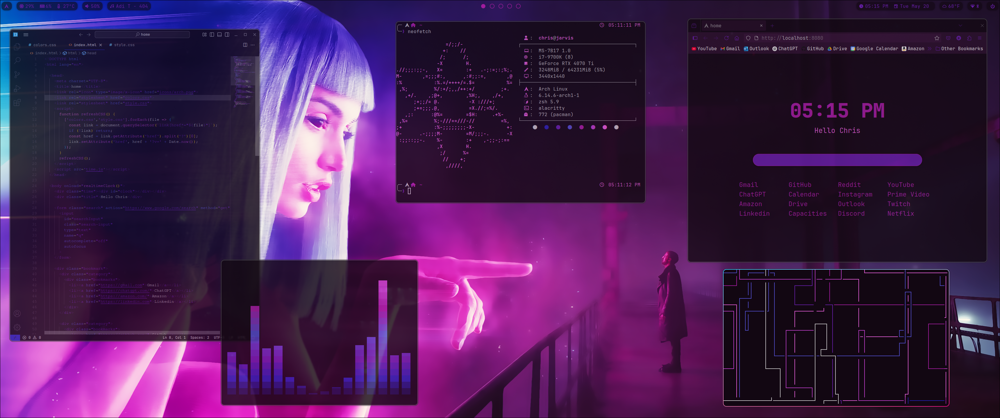
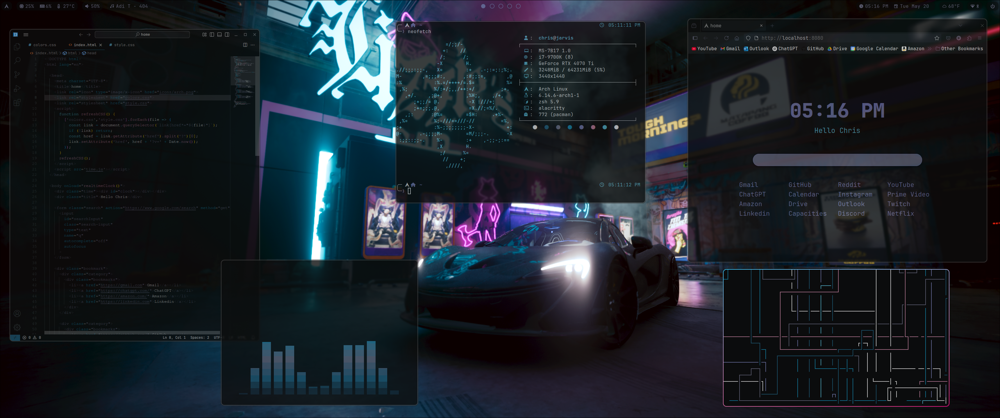
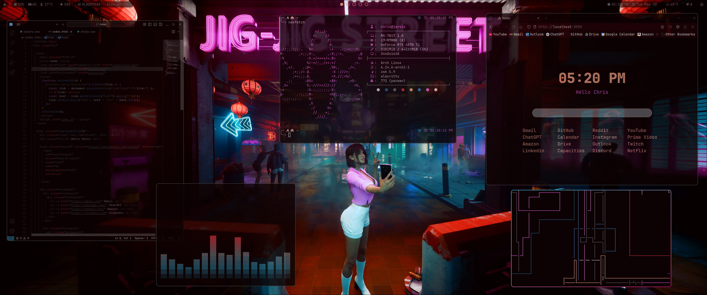
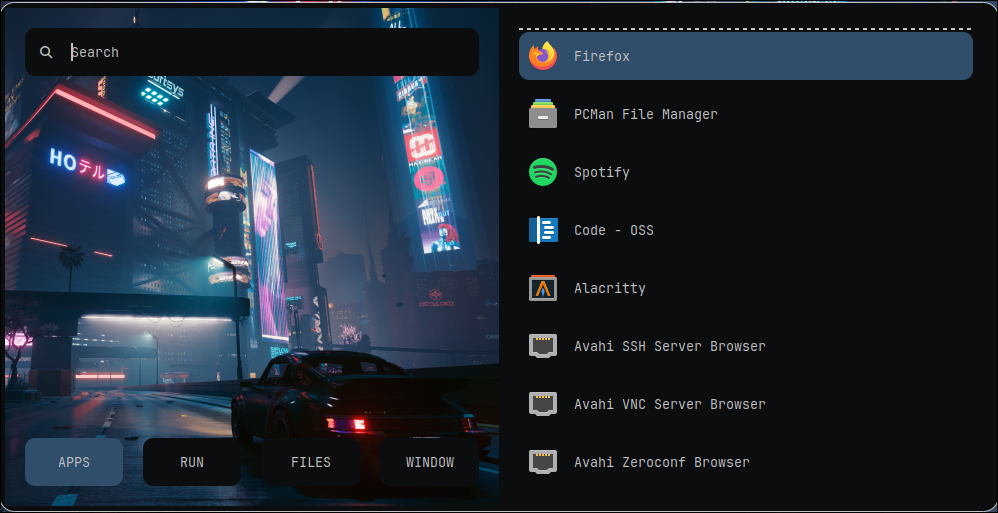
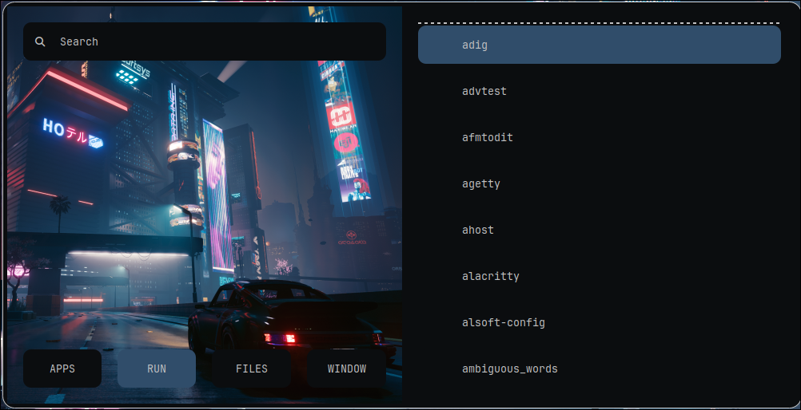
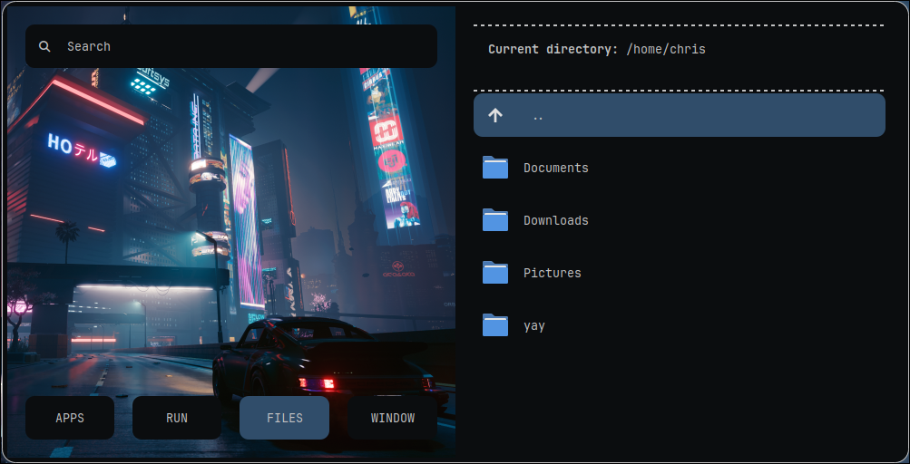
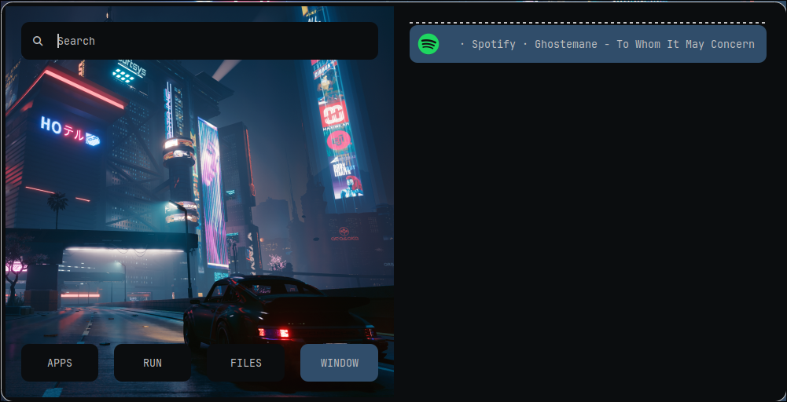

<h2 align="center"> ━━━━━━  ❖  ━━━━━━ </h2>

# Chris' dotfiles

<a name="about"/>

## 👋 <samp>About</samp>

This is my personal repository for my Arch Linux dotfiles, featuring a fully customized Hyprland environment with Pywal theming.

Here is some information about my setup:

- Window Manager: [`hyprwm`](https://github.com/hyprwm/Hyprland)
- Compositor: [`hyprland`](https://github.com/hyprwm/Hyprland)
- Terminal: [`alacritty`](https://github.com/alacritty/alacritty)
- Shell: [`zsh`](https://www.zsh.org/) with [`powerlevel10k`](https://github.com/romkatv/powerlevel10k/)
- Editor: [`neovim`](https://github.com/neovim/neovim)
- Panel: [`waybar`](https://github.com/Alexays/Waybar)
- Application Launcher: [`rofi`](https://github.com/davatorium/rofi)
- File Manager: [`pcmanfm`](https://github.com/lxde/pcmanfm)
- Browser: [`firefox`](https://www.mozilla.org/en-US/firefox/linux/)
- PC Lights: [`openrgb`](https://openrgb.org/)
- Theme Manager: [`pywal`](https://github.com/dylanaraps/pywal)

<a name="showcase"/>

## :camera: <samp>Showcase</samp>

Here are five different colorschemes (using Pywal) based on the wallpapers in `~/Pictures/Wallpapers`. The colorscheme automatically changes depending on the wallpaper:

COLORSCHEME 1


COLORSCHEME 2


COLORSCHEME 3


COLORSCHEME 4


COLORSCHEME 5


<h2></h2>

<a name="rofi-utils"/>

### <samp>Rofi</samp>

These rofi configurations are highly based on [adi1090x/rofi](https://github.com/adi1090x/rofi)

<h2></h2>

##### Rofi app launchers, directory menu and windows menu






<h2></h2>

##### Rofi power menu


<h2></h2>

<a name="features"/>

## <samp>Key Features</samp>

- **Dynamic Theming**: Automatic color scheme generation using Pywal based on wallpaper
- **Custom Waybar**: Hardware monitoring (CPU, GPU, RAM, temp), network stats, weather widget
- **Hyprland Optimizations**: VRR support, custom animations, window rules
- **Multiple Wallpaper Presets**: Quick-switch between 8+ pre-configured themes via keybinds
- **Modern Tools**: neofetch animations, btop, cava visualizer, OpenRGB integration

<a name="installation"/>

## <samp>Installation</samp>

### Prerequisites

Make sure you have the following installed:

```sh
# Core components
sudo pacman -S hyprland waybar alacritty rofi pcmanfm neovim zsh

# Theming and utilities
sudo pacman -S python-pywal hyprpaper openrgb brightnessctl playerctl

# Additional tools
sudo pacman -S btop neofetch cava htop

# Fonts
sudo pacman -S ttf-jetbrains-mono-nerd
```

### Setup

1. Clone this repository:
```sh
git clone https://github.com/yourusername/dotfiles-arch.git ~/dotfiles-arch
cd ~/dotfiles-arch
```

2. Backup your existing configs:
```sh
mkdir -p ~/.config-backup
cp -r ~/.config/hypr ~/.config-backup/
cp -r ~/.config/waybar ~/.config-backup/
cp ~/.zshrc ~/.config-backup/
```

3. Copy configs to your system:
```sh
cp -r .config/* ~/.config/
cp .zshrc_copy ~/.zshrc
cp .p10k.zsh ~/
cp .gtkrc-2.0 ~/
```

4. Set up wallpapers:
```sh
mkdir -p ~/Pictures/Wallpapers
# Copy your wallpapers to ~/Pictures/Wallpapers/
```

5. Configure sensitive data:
   - Edit `~/.config/waybar/scripts/weather.sh` and add your OpenWeatherMap API key
   - Update city name in weather.sh
   - Customize any personal paths in configs

<a name="fonts"/>

### <samp>Fonts</samp>

- [`JetBrainsMono Nerd Font`](https://github.com/jtbx/jetbrainsmono-nerdfont)

<a name="wallpapers"/>

### <samp>Background Wallpaper</samp>

Copy your wallpapers into `~/Pictures/Wallpapers/`:

```sh
mkdir -p ~/Pictures/Wallpapers
# Place your wallpapers here
```

`hyprpaper` is used to set the wallpaper in `hyprland.conf` using `wal-hypr.sh`. Different wallpapers can be used by changing the binds that call the main wal script.

<h2></h2>

<a name="keybindings"/>

### <samp>Hyprland Keybindings</samp>

|Action|Keybinding|
|---|---|
|App launcher|<code>super + d</code>|
|Terminal|<code>super + Return</code>|
|Close window|<code>super + q</code>|
|Toggle floating|<code>super + t</code>|
|Fullscreen|<code>super + f</code>|
|Exit Hyprland|<code>super + m</code>|
|File manager|<code>super + e</code>|
|Power off|<code>super + p</code>|
|Reboot|<code>super + r</code>|
|Suspend|<code>super + shift + s</code>|
|Lock screen|<code>super + l</code>|
|Switch wallpaper theme|<code>super + ctrl + [1-8]</code>|
|Screenshot region|<code>print</code>|
|Screenshot monitor|<code>super + print</code>|

<h2></h2>

<a name="customization"/>

## <samp>Customization</samp>

### Changing Themes

The setup uses Pywal to automatically generate themes. To switch themes:

1. Use the keyboard shortcuts `SUPER + CTRL + [1-8]` to quickly switch between presets
2. Or manually run: `~/.local/bin/wal-hypr.sh /path/to/wallpaper.png`

### Monitor Configuration

Edit `~/.config/hypr/hyprland.conf` and update the monitor line:
```conf
monitor=YOUR-MONITOR, 1920x1080@60, 0x0, 1
```

### Waybar Modules

Waybar configuration can be customized in:
- `~/.config/waybar/config.jsonc` - Module configuration
- `~/.config/waybar/style.css` - Styling (auto-generated by Pywal)
- `~/.config/waybar/scripts/` - Custom scripts for modules

<h2></h2>

<a name="notes"/>

## <samp>Important Notes</samp>

- **API Keys**: The weather script requires an OpenWeatherMap API key. Get one free at [openweathermap.org](https://openweathermap.org/api)
- **GPU Monitoring**: Hardware monitoring script uses `nvidia-smi`. For AMD GPUs, modify `~/.config/waybar/scripts/hardware.sh`
- **Network Interface**: Update the interface name in `~/.config/waybar/config.jsonc` (default is `eno1` for ethernet, `wlp4s0` for wifi)
- **Paths**: All absolute paths have been sanitized to use `~` or standard XDG directories. Adjust if needed.

<h2></h2>

<a name="structure"/>

## <samp>Repository Structure</samp>

```
dotfiles-arch/
├── .config/
│   ├── hypr/           # Hyprland configuration
│   ├── waybar/         # Waybar config and scripts
│   ├── alacritty/      # Terminal config
│   ├── rofi/           # App launcher themes
│   ├── neofetch/       # System info configs
│   ├── btop/           # System monitor
│   ├── cava/           # Audio visualizer
│   └── nvim/           # Neovim configuration
├── .local/bin/         # Custom scripts
├── .zshrc_copy         # Zsh configuration
├── .p10k.zsh           # Powerlevel10k theme
├── .gtkrc-2.0          # GTK2 theming
└── README.md
```

<h2></h2>

<a name="credits"/>

## :tada: <samp>Credits</samp>

- `README.md` inspired by [HynDuf/dotfiles](https://github.com/HynDuf/dotfiles) and [HyDE-Project/HyDE](https://github.com/HyDE-Project/HyDE)
- Rofi configurations based on [adi1090x/rofi](https://github.com/adi1090x/rofi)
- [r/unixporn](https://www.reddit.com/r/unixporn/) for inspiration and motivation

<h2 align="center"> ━━━━━━  ❖  ━━━━━━ </h2>
